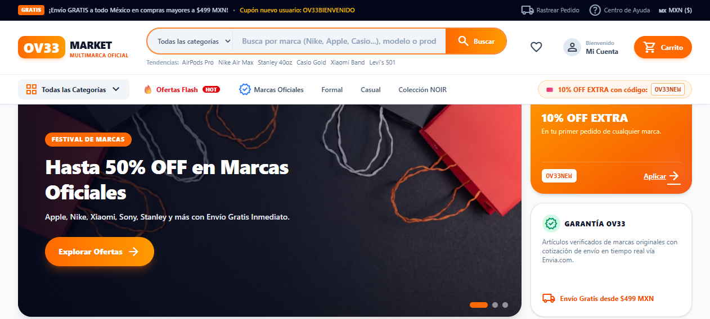

# OV33 Marketplace 🛍️⚡

Plataforma de comercio electrónico multimarca de alta conversión inspirada en la experiencia de usuario y dinamismo de **TEMU, AliExpress y SHEIN**, adaptada para el mercado mexicano con soporte multi-paquetería y pagos seguros.



---

## 🚀 Características Principales

### 🎯 Experiencia de Usuario tipo Marketplace (TEMU / AliExpress / SHEIN)
- **Mega-Buscador Central:** Búsqueda en tiempo real con selector dinámico de departamentos (*Tecnología, Moda & Sneakers, Relojes & Accesorios, Hogar & Hidratación*) y tags de búsqueda en tendencia.
- **Ofertas Relámpago (Flash Deals):** Sección con cronómetro de cuenta regresiva en vivo, badges de descuento intensivo (*-35% OFF*, *-40% OFF*) y stock dinámico con alertas de urgencia.
- **Muro de Marcas Oficiales:** Directorio interactivo de marcas reconocidas (*Apple, Nike, Xiaomi, Sony, Stanley, Casio, Logitech, JBL, Levi's, Samsung, etc.*) con filtrado instantáneo en un clic.
- **Top Ventas Semanal (#1 a #4):** Medallas de ranking y contadores de social proof (`+3.8k vendidos`, calificaciones con estrellas).
- **Barra de Progreso de Envío Gratis:** Umbral dinámico unificado a **$499 MXN** en el carrito lateral y checkout.
- **Catálogo con Filtros Facetados:** Sidebar interactivo para filtrar simultáneamente por departamento, marca con buscador en vivo, rango de precio deslizable, solo ofertas y calificación mínima.

### 💳 Integraciones Transaccionales y Logística
- **Mercado Pago Checkout Pro:** Pasarela de pago segura con soporte para tarjetas de crédito, débito, transferencias bancarias y tiendas de conveniencia (OXXO).
- **Logística Envia.com:** Cotización de tarifas en tiempo real multi-transportista (FedEx, DHL, Estafeta, RedPack), generación de guías y rastreo en vivo paso a paso.
- **Cupones de Descuento:** Soporte para cupones promocionales (`OV33NEW`, `OV33BIENVENIDO`, `FLASH20`).
- **Garantía del Comprador de 30 Días:** Módulo de devoluciones con generación de etiquetas de retorno en la cuenta del usuario.

### 🏢 Portal Mayorista & B2B
- Cotizador y formulario para compras de mayoreo por escala (10-25 piezas, 26-60 piezas, 60+ unidades).
- Generación automática de enlace para atención directa por WhatsApp con folio de seguimiento.
- Almacenamiento y sincronización de prospectos comerciales en Firestore.

### 🛠️ Consola de Administración (Admin Dashboard)
- Resumen financiero en tiempo real (ventas totales, ticket promedio, tasa de conversión).
- Gestión completa de catálogo: agregar, editar variantes (colores, imágenes, tallas/opciones), asignar marcas, marcar como Oferta Flash y gestionar inventario.
- Gestión de prospectos B2B y pedidos.

---

## 💻 Stack Tecnológico

- **Frontend:** React 19, Vite, React Router 7, Tailwind CSS v4, Lucide / Material Symbols.
- **Base de Datos & Auth:** Firebase Firestore, Firebase Authentication, Firebase Storage.
- **Logística & Envíos:** Envia.com API.
- **Pasarela de Pagos:** Mercado Pago SDK.
- **Facturación / Comprobantes:** Generador digital de recibos con código de barras y códigos QR.

---

## 📦 Instalación y Desarrollo Local

1. **Clonar repositorio e instalar dependencias:**
   ```bash
   npm install
   ```

2. **Configurar variables de entorno:**
   Copia el archivo `.env.example` como `.env`:
   ```bash
   cp .env.example .env
   ```
   Rellena tus credenciales de Firebase, Mercado Pago y Envia.com.

3. **Iniciar servidor de desarrollo:**
   ```bash
   npm run dev
   ```
   Abre [http://localhost:5173](http://localhost:5173) en tu navegador.

4. **Compilar para producción:**
   ```bash
   npm run build
   ```

---

## 🔒 Aislamiento de Datos

Para evitar cualquier conflicto con bases de datos heredadas, las colecciones de Firestore para esta plataforma están aisladas bajo los nombres:
- `ov33_products`
- `ov33_categories`
- `ov33_orders`
- `wholesale_leads`
- Almacenamiento local cacheado bajo prefijo `ov33_*`.
